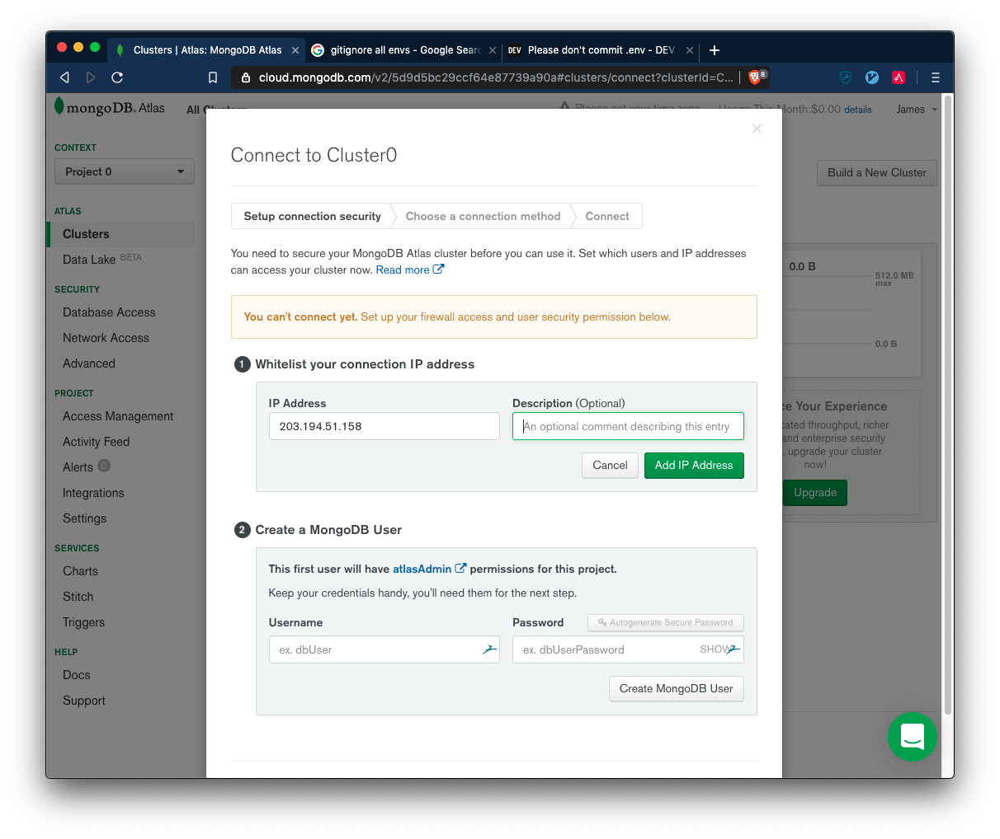

# Environment Variables & Hosted Databases

Recently you would have practiced creating a CRUDy RESTful API with your Starship Review app! The part of that exercise that most significantly diverged from a real world REST API was that it used a single `db.json` file as a database. In the real world this would more likely be a SQL database (MySQL, PostSQL), a NoSQL database (MongoDB), or a cache (Redis). As we will be covering SQL and caches later down the track, why not attempt to get started on MongoDB?


This will give us time to focus on the DevOps of setting up and connecting to a database, as well as give a viable approach for any hobby applications or side projects you might be thinking of.

### 1. Create a mLab mongoDB database


There are a lot of steps here so follow carefully and dont get lost.


1.Navigate to https://cloud.mongodb.com and choose to create a new account. Make sure to select the _Free_ tier.


2. Select **Singapore** as your region. Australia _will not be free_.


3. By default Mongo Atlas will select an M2 and attempt to collect your card details. **Make sure you select the M0 OR YOU WILL BE CHARGED** and that ain't my fault.

   

4. Once the cluster has created (which might take a few minutes) then click the `connect` button on the cluser.




5. You will need to **A: Whitelist your current IP** and ...


6. **B: Create a mongo userame and password**. Only then you can `Choose a connection method`.


7. We are attempting to connect our Python Application to this MongoDB server so click the second option `Connect Your Application`.


8. The Connection String (Or URI) is similar to a URL, however it also contains information about the MongoDB host. We can also look at the "Full Driver Example" to see how this URI can be used within the context of our Python application. **It is highly recommended that you store your URI in a .env file and retrieve it using os.environ['MONGO_URI'], then add your .env to your .gitignore. IF YOU LEAVE YOUR PASSWORD IN YOUR CODE IT CAN END UP ON GITHUB**


9. Test your database! I have attatched some sample code of a script which just stores and deletes a single cafe from the database.

### 2. Connect to it with a simple script and make changes to it with python. See my example script.


As mentioned above the examle code provided will create a database named 'python-mongo-cafes' and a collection called cafes. It will then add and delete a cafe each time you run it.

I recommend you experiment with creating multiple collections etc.

The important thing to note in the script are

```python
import os
from pymongo import MongoClient

client = MongoClient(MONGO_URI) # Connect to Cluster
db = client["python-mongo-cafes"] # Selecting the database
cafes = db.cafes # Selecting the cafes collection
```

1. Connecting to the Cluster, then selecting out the database and collection we want. Note: if the database or collection does not exist it will be created by these steps.

```python
cafe = {
        "name": "Charlie and Franks",
        "coffee": "Good",
        "employees": 16
        }
cafe_id = cafes.insert_one(cafe).inserted_id
```

2. This creates a **cafe** dict then inserts it into the **cafes** collection. It also obtains the `id` which the database assignes to the **cafe** when it is successfully stored in the database.

```python
foundCafe = cafes.find_one({"coffee":"Good"})
```

3. This selects a single cafe where the coffee field is equal to the string "Good". For finding by id you would want to use the field `_id`.

```python
allCafes = list(cafes.find())
```

5. Getting all cafes as a list.

```python
cafes.delete_one({
    "name":"Charlie and Franks"
    })
```

6. Once again you are able to select a single cafe by its field. You can use `_id` to select its id.


### 3. Make a flask application. It will connect to the database, create some crud.


Applying the principles of the last CRUD exercise we did, attempt to create a new CRUD API, adding your new mongoDB as a store for your data. 

You are welcome to come up with your own database, however if you are short on creativity today feel free to use my cafe example.

I recommend starting with just one "*Model*", such as "**Cafes**" in my example. Then later move on to connecting other "*Model*"s, such as employees or meals in this example, later.

## Cafes
| Method | Route        | Description                        | Params `application/json`                               |
|--------|--------------|------------------------------------|---------------------------------------------------------|
| GET    | /cafes/      | Return array of all cafes          |                                                         |
| GET    | /cafes/{id}/ | Return cafe of id `id`             |                                                         |
| POST   | /cafes/      | Create cafe                        | `{ "name": string, "coffee": string, "employees": int}` |
| PUT    | /cafes/{id}/ | Update cafe of id with new details | `{ "name": string, "coffee": string, "employees": int}` |
| DELETE | /cafes/{id}/ | Delete cafe of id                  |                                                         |


### Beast Mode

First designing a rough ERD, Add another "Model" which has a foreign key of the existing model in your database. As mentioned; for the Cafe example this could be something like Employee or Meal. I'll leave it up to you.
